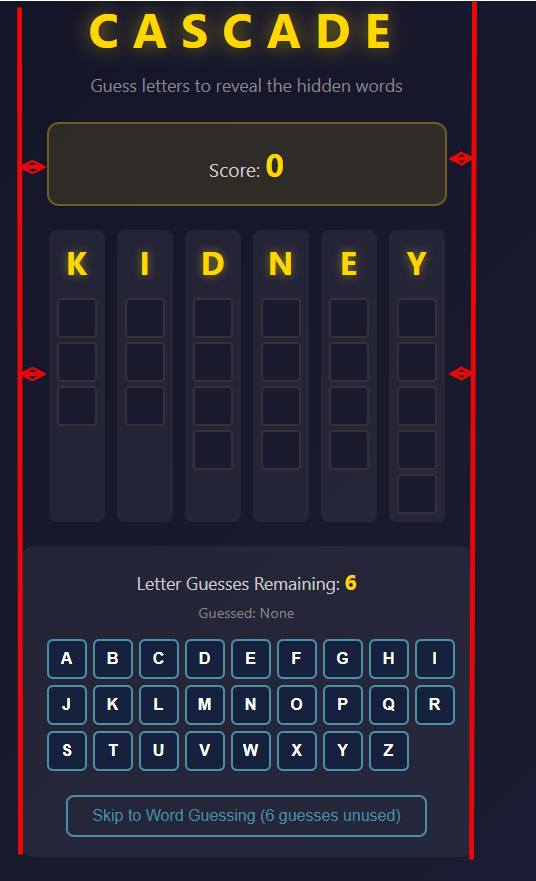

# Letter Selection

- Only allow a max of selecting two vowels per game
- Allow for keyboard input for letting guess

# Scoring

During the guessing phase, after all letters have been selected by user OR they skip to word guessing:

If they guess the word correctly:

- Apply the initial base score based on the table below
- Apply the multipler to the base score, the multiple is based on how many letters were unrevealed at the time of the guess

| Letter | Letter count | Base Score | Multiplier                  |
| :----- | ------------ | ---------- | --------------------------- |
| 1      | 4            | 100        | x1 per unrevealed letter    |
| 2      | 4            | 100        | x1 per unrevealed letter    |
| 3      | 5            | 200        | x1.25 per unrevealed letter |
| 4      | 5            | 200        | x1.25 per unrevealed letter |
| 5      | 5            | 200        | x1.25 per unrevealed letter |
| 6      | 6            | 300        | x2 per unrevealed letter    |

- If a word is completed as part of the letter selection phase, they get the based score bsaed on the table above and automatically get the the multipier applied for each letter in the word. For example, FLOWER is the main word the 1 letter would be F. If they went through the letter guess phase and they select U and L and it completed the word "FULL" their score would be 100\*4 = 400 points

# Word Guess Phase

- if a user compeleted a word during the letter guess phase, then they should not have to guess the word and it coulds a correct guess (applying teh score from above).
- remove GUESS text box
- User should be click on the word they want to select, and use keyboard to enter input. If they don't select a specific blank letter spcae, the key press should input into the first availble, the second input the second avilable, etc.
- The button with the check mark should still be avialable and function the same.

NEW:

- Show guessed letters somwehwere for reference

# Visuals

- Everything looks like its in dark mode, update to just be light mode.
- I'd like the score board the letter word column container and the letter guess panel to all be the same width and look clean that way. see annoted screenshot:
